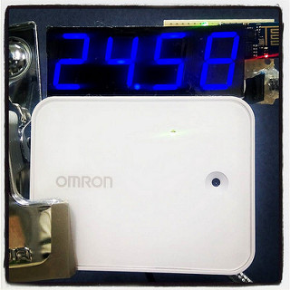

mqtt_pomodoro_timer
====

setup
----

    $ sudo gem install mqtt
    $ sudo gem install pit
    
    $ mkdir -p ~/work/
    $ cd ~/work/
    $ git clone https://github.com/yoggy/mqtt_pomodoro_timer.git
    $ cd mqtt_pomodoro_timer
     
    $ EDITOR=vim pit set mqtt_pomodoro_timer
    
    ---
    remote_host: mqtt.example.com
    remote_port: 1883
    use_auth: true
    username: username
    password: password
    subscribe_topic: hvcc_face0      # <- https://github.com/yoggy/mqtt_tiny_clock_pub
    check_key: detect_face_num
    publish_topic: 7seg0001          # <- https://github.com/yoggy/node-omron-hvc-c-test
    
    $ ./mqtt_pomodoro_timer.rb
        .
        .
       (check your mqtt connection...)
        .
        .
    ^C
    
    $ sudo cp mqtt_pomodoro_timer.conf.sample /etc/supervisor/conf.d/mqtt_pomodoro_timer.conf
    $ sudo vi /etc/supervisor/conf.d/mqtt_pomodoro_timer.conf
      (fix path, username, etc...)
    $ sudo supervisorctl reread
    $ sudo supervisorctl add mqtt_pomodoro_timer
    $ sudo supervisorctl status
    mqtt_pomodoro_timer                  RUNNING    pid 8192, uptime 0:00:30
    
Copyright and license
----
Copyright (c) 2015 yoggy

Released under the [MIT license](LICENSE.txt)

